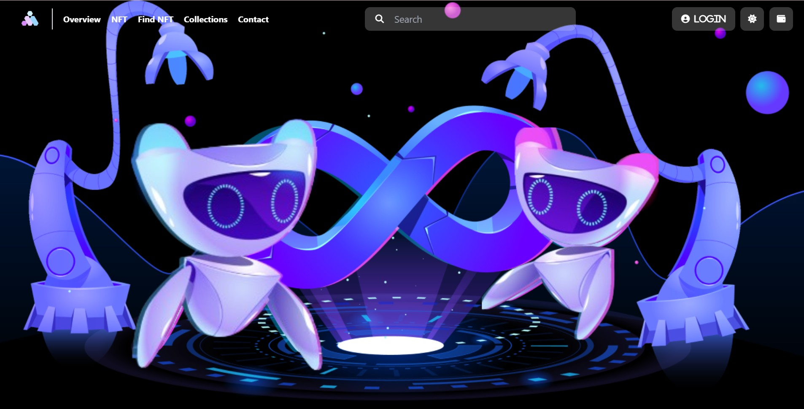
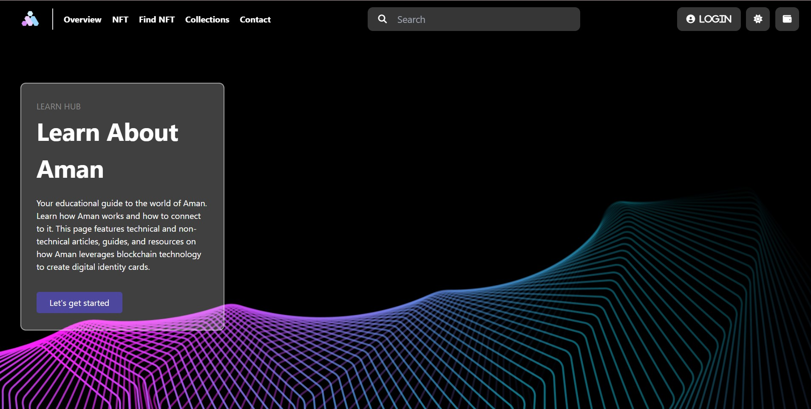
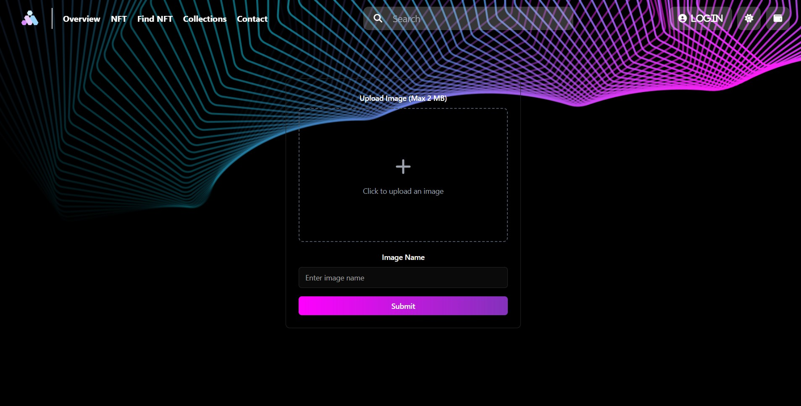
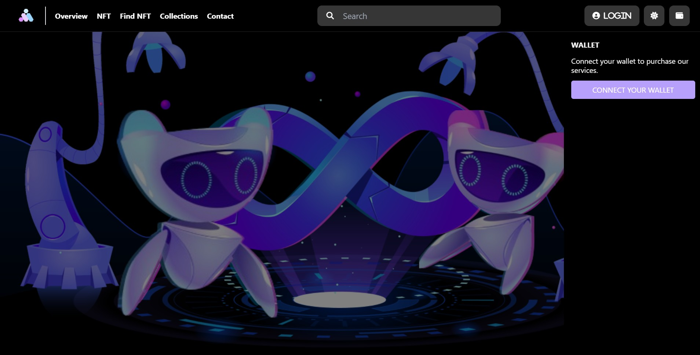
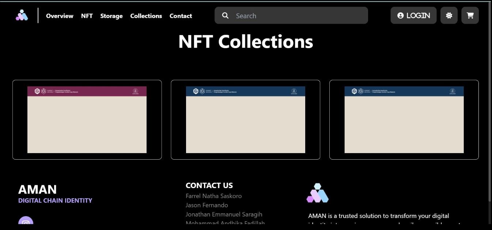

# Hackathon 9.0 Codefest

> ## **Table of Contents**

- [General Information](#general-information)
- [Requirements](#requirements)
- [How to Run and Compile](#how-to-run-and-compile)
- [Screenshots](#screenshots)
- [Author](#author)

## **General Information**
Welcome to AMAN, a Web3 platform that leverages blockchain technology to create
secure, decentralized digital identity cards and manage critical assets like certificates, stamps, and seals. AMAN is a B2B business solutions that works with government, schools, universities, and other agency.

## **How It Works**
1. **Document Upload** <br> Users upload their ID Card, certificates, or legal stamps to the AMAN platform.

2. **Conversion** <br> Documents are encrypted and converted into NFTs on the blockchain.

3. **Payments** <br> The Payment bill will be seen after the conversion process and can be paid using wallet

4. **Secure Access** <br> Only the document owner can share or revoke access. The NFT that was owned was shown in the NFT Collections

## **How to Run and Compile**
### **Setup**

1. Clone this repository <br>

```sh
$ git clone git@github.com:JasonFernandoo/CodeFest.git
```
2. Open this repository in terminal

### 1. Install developer tools.

You can install the developer tools natively or develop using Dev Containers.

#### Option 1: Natively install developer tools

> Installing `dfx` natively is currently only supported on macOS and Linux systems. On Windows, it is recommended to use Dev Containers below.

1. Install `dfx` with the following command:

```
sh -ci "$(curl -fsSL https://internetcomputer.org/install.sh)"
```

2. [Install NodeJS](https://nodejs.org/en/download/package-manager).

> On Apple Silicon (e.g., Apple M1 chip), make sure you have Rosetta installed (`softwareupdate --install-rosetta`).

3. For Rust projects, you will also need to:

- Install [Rust](https://doc.rust-lang.org/cargo/getting-started/installation.html#install-rust-and-cargo): `curl https://sh.rustup.rs -sSf | sh`
- Install [candid-extractor](https://crates.io/crates/candid-extractor): `cargo install candid-extractor`

4. For Motoko projects, you will also need to:

- Install the Motoko package manager [Mops](https://docs.mops.one/quick-start#2-install-mops-cli): `npm i -g ic-mops`

Lastly, navigate into your project's directory that you downloaded from ICP Ninja.

#### Option 2: Dev Containers

Continue building your projects locally by installing the [Dev Container extension](https://marketplace.visualstudio.com/items?itemName=ms-vscode-remote.remote-containers) in VS Code and [Docker](https://docs.docker.com/engine/install/).

Make sure Docker is running, then navigate into your project's directory that you downloaded from ICP Ninja and start the Dev Container by selecting `Dev-Containers: Reopen in Container` in VS Code's command palette (F1 or Ctrl+Shift+P).

### 2. Create a local developer identity.

To manage your project's canisters, it is recommended that you create a local [developer identity](https://internetcomputer.org/docs/current/developer-docs/getting-started/accounts) rather than use the `dfx` default identity that is not stored securely.

To create a new identity, run the commands:

```
dfx start --background
dfx identity new IDENTITY_NAME
dfx identity use IDENTITY_NAME
```

Replace `IDENTITY_NAME` with your preferred identity name. The first command, `dfx start --background` starts the local `dfx` processes, then `dfx identity new` will create a new identity and return your identity's seed phase. Be sure to save this in a safe, secure location.

The third command, `dfx identity use` will tell `dfx` to use your new identity as the active identity. Any canister smart contracts created after running `dfx identity use` will be owned and controlled by the active identity.

Your identity will have a **principal ID** associated with it. Principal IDs are used to identify different entities on ICP, such as users and canisters.

[Learn more about ICP developer identities](https://internetcomputer.org/docs/current/developer-docs/getting-started/accounts).

### 3. Deploy the project locally.

Deploy your project to your local developer environment with the commands:

```
dfx deploy
```

Your project will be hosted on your local machine. The local canister URLs for your project will be shown in the terminal window as output of the `dfx deploy` command. You can open these URLs in your web browser to view the local instance of your project.

## Screenshots
1. Landing Page 
    
2. Overview Page 
    
3. Document Upload Page
    
4. Payments Page
    
5. Secure Access Page
    

## Author

|         **Name**          | **University** |
| :-----------------------: | :-----------------------------------: |
| Jonathan Emmanuel Saragih   |    Bandung Institute Of Technology    |
|   Satriadhikara Panji Yudhistira    |    Bandung Institute Of Technology    |
| Mohammad Andhika Fadillah |    Bandung Institute Of Technology    |
| Farrel Natha Saskoro    |    Bandung Institute Of Technology    |
| Jason Fernando   |    Bandung Institute Of Technology    |